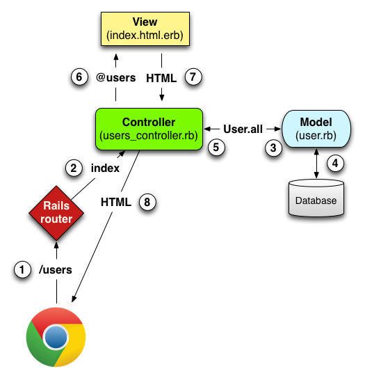

# Rails Overview



## Router

When HTTP Requests are sent to a Rails server, they first make contact with the 
**ROUTER**. Which sends the request to the appropriate **CONTROLLER** based on 
the **METHOD** & **PATH**. The **ROUTER** also tells the **CONTROLLER** which 
**ACTION** to execute. 

### Request/Response

HTTP Request goes from **CLIENT** to **SERVER**
* Mandatory components
  * method (GET, PUT, PATCH, POST, DELETE)
  * path (/users/1/posts/)
* Optional components
  * query (?loc=NY&name=daniel)
  * body - additional data which can come from a form. **cannot** be part of a GET request

HTTP Response goes from **SERVER** to **CLIENT**
* status (200 OK, 300 Redirect, 400 Client error, 500 Server error)
* body - main response

### RESTful Routes

REST: Representational State Transfer

|   HTTP Verb  |       path       | action |                    utility                   |
|:------------:|:----------------:|:------:|:--------------------------------------------:|
|      GET     |      /photos     |  index |         display a list of all photos         |
|      GET     |    /photos/new   |   new  | return an HTML form for creating a new photo |
|     POST     |      /photos     | create |         upload and create a new photo        |
|      GET     |    /photos/:id   |  show  |           display a specific photo           |
|      GET     | /photos/:id/edit |  edit  |    return an HTML form for editing a photo   |
| PATCH or PUT |    /photos/:id   | update |            update a specific photo           |
|    DELETE    |    /photos/:id   | delete |            delete a specific photo           |

## Controllers

The Router instantiates an *instance of a controller* and invokes an action on that
controller. Controllers handle the communication between the Views and the Models
by sending commands to the model and contructing the server's HTTP Response. 

Controller < ApplicationController < ActionController::Base

### Parameters

Parameters can come from THREE places:
1. Query string
  * localhost:3000/posts?tags=tech
    * params = { action: index, controller: posts, tags: tech }
2. Request body
3. Wildcards
  * localhost:3000/users/141
    * params = { action: show, controller: users, id: 141 }

#### Strong Parameters

Rails params has built in methods to filter a request's parameters
* require()
* permit()
* [and more](https://api.rubyonrails.org/classes/ActionController/Parameters.html)

params.require(:users).permit(:fname, :lname)

## Models

ActiveRecord handles the Model portion of the MVC framework. It uses Object
Relational Mapping to translate rows retrieved from the database to objects. 

Model < ApplicationRecord < ActiveRecord::Base

### Validations 

ActiveRecord allows us to validate models before they get persisted to the database. 
Model validations are run when you invoke #save or #update on the model. If the 
validation fails, then the SQL INSERT or UPDATE operations won't be performed. 

### Associations

An association is a connection between two Active Record models. For example, a
user might have many posts, which has many comments. In that case, we would 
write the associations like so:

``` ruby
class User < ApplicationRecord 
  has_many :posts,
    # class_name: :Post,
    # foreign_key: :user_id,
    # primary_key: :id

  has_many :comments,
    # class_name: :Comment,
    # foreign_key: :commenter_id,
    # primary_key: :id
end

class Post < ApplicationRecord 
  belongs_to :user,
    # class_name: :User,
    # foreign_key: :user_id,
    # primary_key: :id

  has_many :comments,
    # class_name: :Comment,
    # foreign_key: :post_id,
    # primary_key: :id
  
  has_many :commenters,
    through: :comments,
    source: :user
end

class Comment < ApplicationRecord
  belongs_to :user,
    # class_name: :User,
    # foreign_key: :user_id,
    # primary_key: :id

  belongs_to :post,
    # class_name: :Post,
    # foreign_key: :post_id,
    # primary_key: :id
end
```

## PostgreSQL

* PostgreSQL is a relational database management system. 
* Relational databases store data in the form of tables and rows, which allows 
for complex queries that require associations. 
* Relational databases are vertically scalable; you can increase the load on a 
single server by adding more CPU, RAM, or SSD capacity. 
* Follows ACID properties
  * A: atomic
    * All or nothing transactions
  * C: consistent
    * All data will follow defined rules before and after transactions
  * I: isolated
    * Transactions are guaranteed to be independent of each other
  * D: durable
    * Data will persist after a transaction even if the system crashes

## Migrations

A migration is a file that describes a set of changes to a database. 

Utility:
* Create or drop tables
* Add, remove, or edit columns

``` ruby
class CreateUsers < ActiveRecord::Migration[5.2]
  def change
    create_table :users do |t|
      t.string :email, null: false
      t.string :password_digest, null: false
      t.string :session_token, null: false
      t.string :fname, null: false
      t.string :lname, null: false
      t.string :location, null: false
      t.string :headline, null: false
      t.string :industry, null: false
      t.text :summary

      t.timestamps
    end

    add_index :users, :email, unique: true
    add_index :users, :session_token, unique: true
    add_index :users, :fname
    add_index :users, :lname
    add_index :users, :location
    add_index :users, :headline
    add_index :users, :industry
  end
end
```